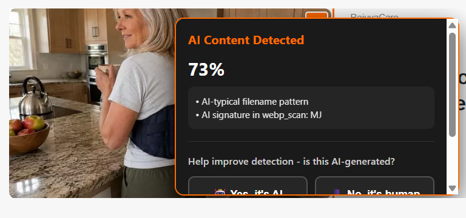
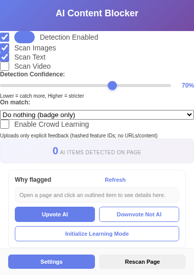

# SlopBlocker

SlopBlocker is a local-first Chrome extension that highlights likely AI-generated content on pages you browse. It is designed for manual installation from source, not Chrome Web Store distribution.





Images carrying signed [C2PA Content Credentials](https://c2pa.org/) get a
neutral "CR" provenance chip; content the credentials can't vouch for —
unsigned, stripped, or undisclosed — still gets scored and badged.


## Measured accuracy

The text scorer (`src/slop-score.js`) is fully transparent -- every signal is a named, human-auditable statistic: Burrows-Delta stylometry over a published function-word table (`src/slop-stylometry.js`), a published weighted style-phrase lexicon (`src/slop-lexicon.js`), sentence-length burstiness, degenerate-repetition statistics, structural cadence, invisible/zero-width character forensics, mixed-script homoglyph forensics, human-error forensics (typos, homophone slips, dropped apostrophes), and formal-register counter-evidence. No neural model, no network call, no training data shipped.

Held-out results (`test/benchmark.mjs`; corpora rebuilt by `test/fetch-bench.mjs`, tokenization-normalized so no detector can score dataset preprocessing):

| Corpus | AUROC | Best accuracy | TPR @ 5% FPR |
|---|---|---|---|
| HC3 (chat-register human vs ChatGPT) | **0.919** | 84.1% | 63.7% |
| RAID (11 generators, 3 domains, incl. adversarial attacks) | **0.801** | 92.8% | 40.6% |

The previous heuristic detector scored 0.678 on HC3 and 0.29 -- worse than chance -- on RAID formal domains. For context, the RAID benchmark paper reports commercial trained detectors also degrading toward chance under these adversarial attacks.

The channel mix is a published logistic weight table (SCORE_WEIGHTS in src/slop-score.js) fit on the tune corpora and validated held-out; evasion characters are folded before statistics so mangling cannot starve them. The default flag threshold (0.688) is the measured ~5% false-positive point: for an audience that must be protected from false accusations, precision outranks recall. Character-forensic signals (zero-width characters, mixed-script homoglyphs) flag unconditionally -- their false-positive rate on typed text is effectively zero, and each flag explains itself in plain words. Detection is probabilistic: treat every result as a lead to inspect, not a verdict.

## Responsible use, privacy, and disclaimers

SlopBlocker highlights signals; it does not judge people. Its output is probabilistic, has a measured error rate, and **must not be the sole basis for any accusation, grade, or adverse action** -- see [DISCLAIMER.md](DISCLAIMER.md) for the full responsible-use guidance (including for educators) and [PRIVACY.md](PRIVACY.md) for exactly what data the extension touches (short version: everything stays on your machine; the extension makes no network requests of its own).

## License

Source-available under the [PolyForm Noncommercial License 1.0.0](LICENSE): free for personal, educational, research, and nonprofit use -- read it, run it, modify it, share it. **Commercial use requires a separate license from the author** (Ryan P. Walsh -- reach out via [GitHub](https://github.com/rpwalsh)). See [LICENSE.md](LICENSE.md) for the plain-words summary.


## Features

- Highlights likely AI-generated text and image content on ordinary web pages.
- Shows confidence and evidence when a detected item is selected.
- Supports badge-only mode by default, plus optional blur, watermark, or hide modes.
- Provides popup controls for detection, image/text/video scanning, sensitivity, rescan, and settings.
- Supports local feedback logs so users can mark detections as AI or not AI.
- Builds a clean unpacked extension folder for local Chrome loading.
- Includes release gates for manifest integrity, permissions, syntax checks, privacy defaults, and server dependency audit.

## Privacy Model

Default behavior is local-first.

- Crowd learning is off by default.
- No default remote analytics endpoint is configured.
- The extension stores settings and local feedback in Chrome extension storage.
- Page URLs and content are not uploaded unless the user explicitly enables crowd learning and configures a trusted endpoint.
- Crowd-learning packets are intended to contain schema-like feature IDs and coarse feedback, not raw page text or full URLs.

The extension still needs broad host access because it runs content scripts on pages the user wants scanned. That permission is powerful, so the codebase keeps the required Chrome API permissions narrow: storage, tabs, alarms, and context menus.

## Manual Install

See [QUICKINSTALL.md](QUICKINSTALL.md).

Short version:

```powershell
powershell -ExecutionPolicy Bypass -File .\scripts\install-local.ps1
```

Then open `chrome://extensions`, enable Developer mode, choose "Load unpacked", and select:

```text
dist\local
```

## Development

Run the release checks:

```powershell
powershell -ExecutionPolicy Bypass -File .\scripts\test-release.ps1
```

Or run the Node-only tests:

```powershell
npm test
```

The old simulated E2E script has been replaced with a manual checklist in [test/manual-e2e-checklist.md](test/manual-e2e-checklist.md). Do not treat manual checklist items as automated proof.


## Limitations

- AI detection is heuristic and can produce false positives and false negatives.
- Some sites prevent media inspection through browser or CORS rules.
- Content scripts run in Chrome's extension context, so page-level network interception is limited.
- Video analysis is off by default because it is heavier than image and text scanning.
- Manual installation means updates are manual unless you build your own distribution process.

## Release Standard

A clean local release should satisfy:

- `scripts/test-release.ps1` passes.
- `scripts/install-local.ps1` creates `dist\local`.
- Chrome loads `dist\local` without manifest or service-worker errors.
- Popup opens on an ordinary page.
- Rescan works.
- Crowd learning remains off until the user enables it and sets an endpoint.
- No private keys, sqlite files, or `node_modules` are included in the release folder.

